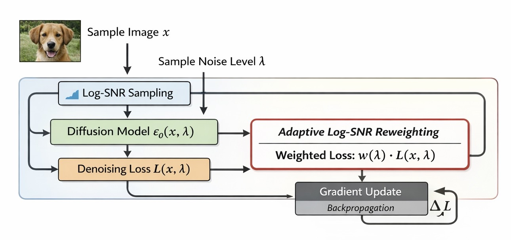
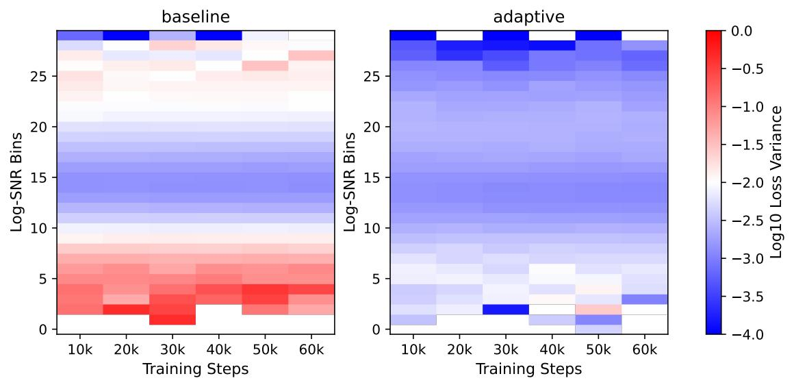

# Variance-Aware Adaptive Weighting for Diffusion Model Training
📍Offical Pytorch Implementation

📖 Paper: Variance-Aware Adaptive Weighting for Diffusion Model Training
--------------------------------------------------------------

&nbsp;&nbsp;&nbsp;&nbsp; Authors: Nanlong Sun, Lei Shi
  
&nbsp;&nbsp;&nbsp;&nbsp; Submitted to Neurocomputing
  
📝link: https://arxiv.org/abs/

🌎 Abstract
--------------------------------------------------------------

Diffusion models have recently achieved remarkable success in generative modeling, yet their 
training dynamics across different noise levels remain highly imbalanced, which can lead to 
inefficient optimization and unstable learning behavior. In this work, we investigate this 
imbalance from the perspective of loss variance across log-SNR levels and propose a variance-aware adaptive weighting strategy to address it. The proposed approach dynamically adjusts 
training weights based on the observed variance distribution, encouraging a more balanced 
optimization process across noise levels. Extensive experiments on CIFAR-10 and CIFAR-100 
demonstrate that the proposed method consistently improves generative performance over 
standard training schemes, achieving lower Fréchet Inception Distance (FID) while also 
reducing performance variance across random seeds. Additional analysis, including loss-log-SNR visualization, variance heatmaps, and ablation studies, further reveal that the adaptive 
weighting effectively stabilizes training dynamics. These results highlight the potential of 
variance-aware training strategies for improving diffusion model optimization.

🗺️ Framework
--------------------------------------------------------------

  

🎯 Method
--------------------------------------------------------------

### Overview

Diffusion models are commonly trained using a noise prediction objective across different noise levels. However, the training process can be highly **imbalanced across log-SNR regions**, leading to large variance in per-sample losses.

To address this issue, we introduce a **variance-aware adaptive reweighting strategy** that dynamically adjusts the contribution of each training sample.

---

### Diffusion Training Objective

The standard diffusion training objective predicts the added noise:

$$
\mathcal{L} = \mathbb{E}_{x,\epsilon,t}
\left[
\|\epsilon - \epsilon_\theta(x_t,t)\|^2
\right]
$$

where

- $x$ is the clean data sample  
- $\epsilon \sim \mathcal{N}(0,I)$ is Gaussian noise  
- $\epsilon_\theta$ is the noise prediction network  

The noisy sample is constructed as

$$
x_t = \alpha_t x + \sigma_t \epsilon
$$

Many diffusion frameworks parameterize the noise level using **log-SNR**:

$$
\lambda = \log\left(\frac{\alpha_t^2}{\sigma_t^2}\right)
$$

---

### Adaptive Loss Reweighting

Let the per-sample loss be

$$
\ell_i = \|\epsilon_i - \epsilon_\theta(x_{t_i},t_i)\|^2
$$

We compute a normalized adaptive weight:

$$
w_i = 1 + \alpha \frac{\ell_i - \mu}{\sigma}
$$

where $\mu$ and $\sigma$ are the batch mean and standard deviation.

The final training objective becomes
  
$$
\mathcal{L}_{adaptive} = \mathbb{E}(w_i \cdot \ell_i)
$$

This mechanism increases the influence of harder samples and encourages **more balanced optimization across log-SNR levels**.

📦 Installation
--------------------------------------------------------------

### Install Dependencies

We recommend using conda to create a clean environment.

python==3.12.7

torch>=2.0 | torchvision>=0.15 | pytorch-fid>=0.3.0 | 
numpy>=1.23| matplotlib>=3.7   | pandas>=1.5        |
tqdm>=4.65

### Dataset

Download CIFAR-10 and place it under folder('./data(CIFAR10)')

Download CIFAR-100 and place it under folder('./data(CIFAR100)')

🎉 Results
--------------------------------------------------------------

### Results (FID)

We evaluate our method on CIFAR-10 and CIFAR-100 using the FID.

| Sampling Strategy | FID | FID |
|-------------------|-----|-----|
|                   | CIFAR-10 | CIFAR-100 |
|     Log-normal    |   14.21  |   23.31   |
|        Ours       |   13.58  |   20.89   | 

### Results (Variance)

Our method reduces the variance imbalance across log-SNR regions and improves training stability.

  

💌 Notes
--------------------------------------------------------------

The naming of folders follows the section titles of the paper. 
For better understanding, we suggest reviewing the code while reading paper.

🌟 Citation
--------------------------------------------------------------

If you find this work useful for your research, please cite the paper.

If you find this work helpful for your mood, pleasr give us a star.

Have a nice day. 🥰🥰🥰
